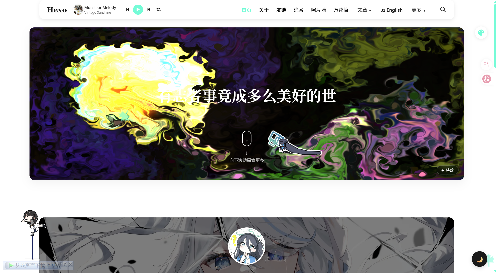
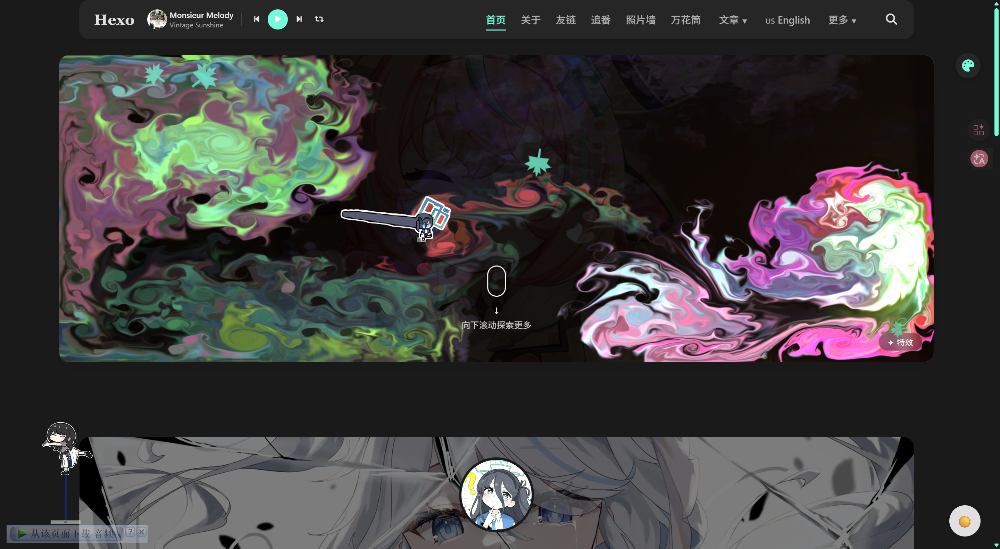
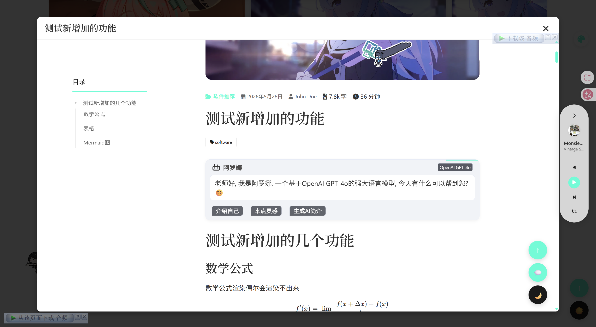
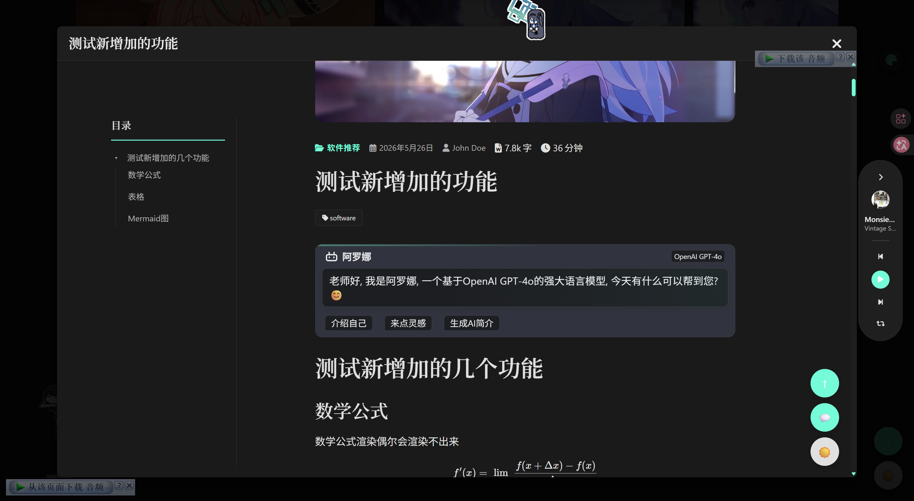
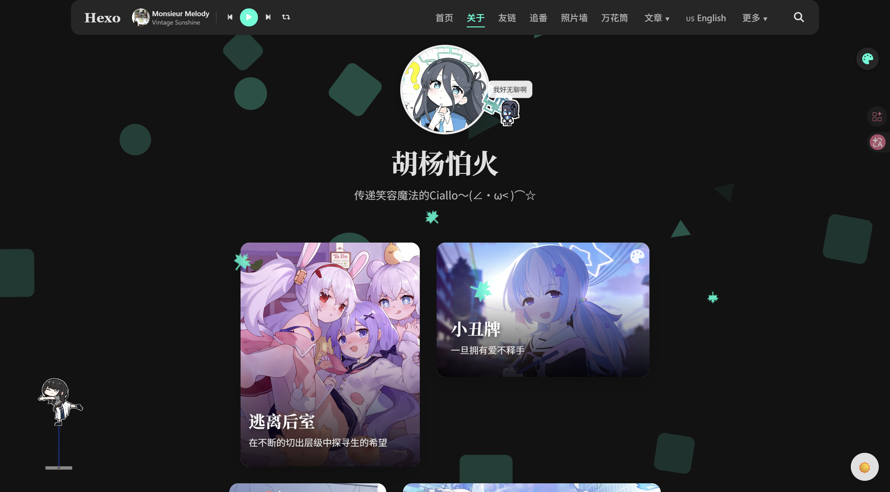
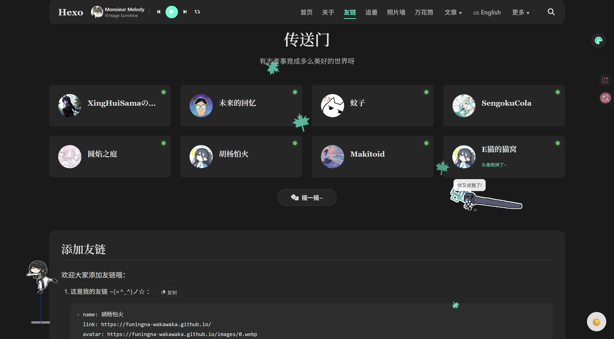
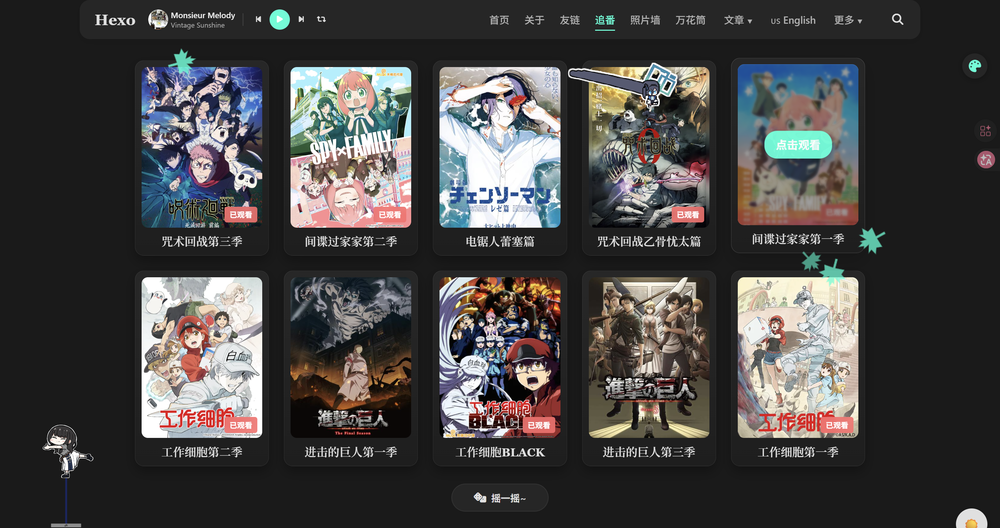
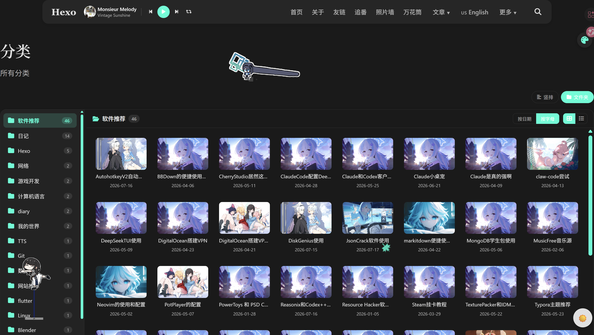
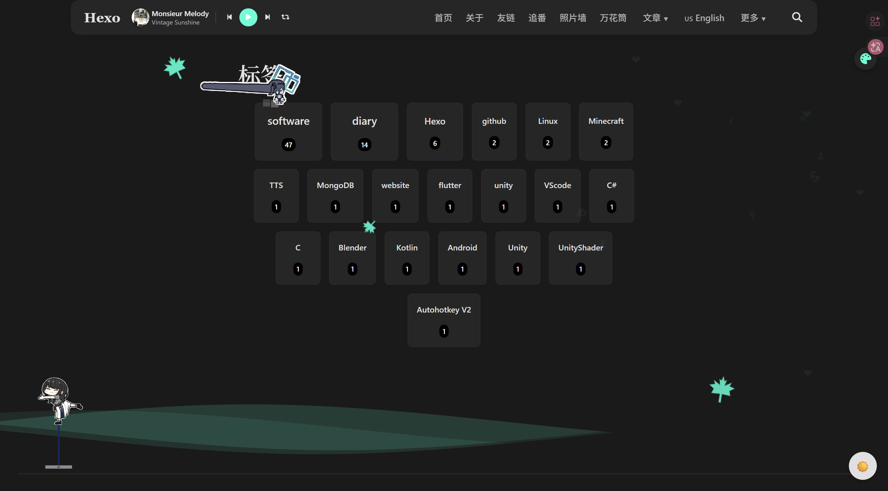
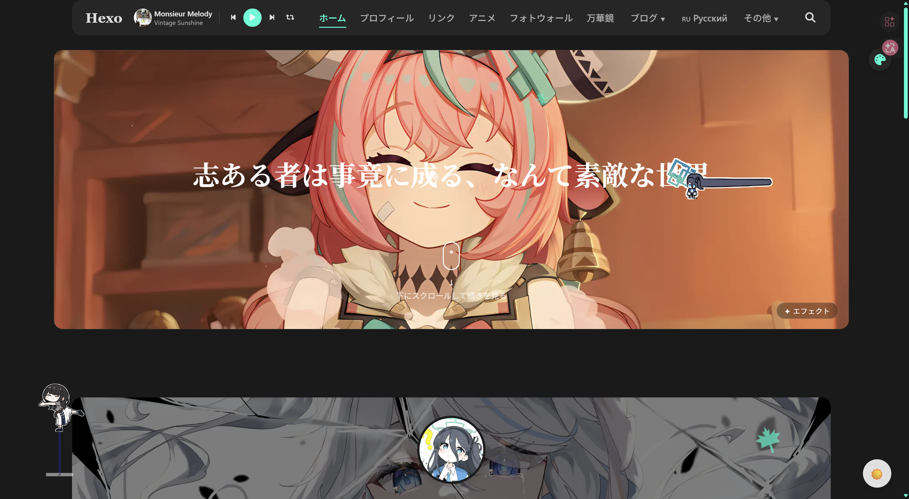

# Magzine 主题

一款现代化的杂志风格 Hexo 主题:大屏支持、简洁优雅,内置桌宠、Sakana 小人、
评论、AI 摘要、音乐播放器、首页 WebGL 特效等大量可开关组件,并做了深度的
性能优化(构建期图片压缩/WebP、按视口渲染、rAF 合帧交互)。

**多语言**:中 / 英 / 日 / 俄 四套界面随语言文件自动切换,新增语言只需加一份 yml。

[English](README_en.md) | [主题文档 docs/](docs/README.md)

## 预览

查看我的[博客](https://funingna-wakawaka.github.io/)

👉 [标签语法使用文档](https://funingna-wakawaka.github.io/2026/03/22/%E8%BD%AF%E4%BB%B6%E7%9B%B8%E5%85%B3/%E4%B8%BB%E9%A2%98%E7%9A%84%E4%B8%80%E4%BA%9B%E6%A0%87%E7%AD%BE%E8%AF%AD%E6%B3%95/)

### 明暗双态

| 亮色模式 · 主页 | 暗色模式 · 主页 |
|---|---|
|  |  |

| 亮色模式 · 文章页 | 暗色模式 · 文章页 |
|---|---|
|  |  |

### 独立页面

| 关于页 | 友链页 |
|---|---|
|  |  |

| 追番页 | 分类页 |
|---|---|
|  |  |

| 标签页 | 多语言界面 |
|---|---|
|  |  |

## 主要特性

- **多语言**:中/英/日/俄 界面实时切换,内容字段(`title_en`…)、日期格式、
  AI 回复语言全部跟随;新增语言 = 新增一份 `language/xx.yml`
- **性能**:构建期路由流图片压缩/WebP(引用自动改写,一次构建即生效)、
  全站脚本 defer、评论/图表/公式按视口懒加载、离屏内容跳过渲染
- **首页特效**:流体模拟与水彩光晕(WebGL),可扩展框架 + 可视化调参面板
  (特效面板支持快捷键收起、参数持久化、离屏自动暂停)
- **代码块 v2**:深浅自适应卡片、行号、复制、折叠、滚轮横滑、语言标签
- **查看器三件套**:图片 / 表格 / Mermaid 全屏查看,1:1 拖拽跟手 + 惯性 + 橡皮筋
- **桌宠**:状态机 AI、发丝物理、文字避让(视口懒包裹,长文不卡)、
  内置迷你音乐播放器、右键菜单
- **组件**:Sakana 小人、动态光标、落叶 / 点击特效、调色盘、本地搜索、
  RSS、pjax 无感刷新、读者设置面板(右键)
- **内容标签**:按钮 / 图片 / 轮播 / 折叠 / 提示 / 隐藏 / 徽章 / 选项卡 /
  时间线 / 视频(点击加载门面,不自动播放)
- **AI 摘要**:内置"阿罗娜"面板,提示词随语言变化,AI 用当前界面语言作答

## 安装

1. 将主题克隆或下载到 Hexo 项目的 `themes` 目录:

```bash
git clone https://github.com/huyangpahuo/magzine-branch.git themes/magzine
```

2. 修改 Hexo 站点的 `_config.yml`:

```yaml
theme: magzine
```

3. 安装依赖(`npm install`),确保 `package.json` 包含:

```json
"hexo": "^8.0.0",
"hexo-generator-archive": "^2.0.0",
"hexo-generator-category": "^2.0.0",
"hexo-generator-feed": "^4.0.0",
"hexo-generator-index": "^4.0.0",
"hexo-generator-search": "^2.4.3",
"hexo-generator-tag": "^2.0.0",

"hexo-renderer-ejs": "^2.0.0",
"hexo-renderer-marked": "^7.0.0",
"hexo-renderer-pug": "^3.0.0",
"hexo-renderer-stylus": "^3.0.1",
"hexo-server": "^3.0.0",
"hexo-util": "^3.3.0"
```

### 增强插件

| 插件 | 功能 |
| --- | --- |
| `hexo-wordcount` | 文章字数统计 / 阅读时长 |
| `hexo-generator-search` | 站内搜索 |
| `hexo-filter-mermaid-diagrams` | Mermaid 图表 |
| `sharp` | 构建期图片压缩/WebP(配合主题 `compress_images` 配置) |
| `hexo-generator-feed` | RSS 订阅 |
| `hexo-asset-img` `hexo-image-link` | 使用 img 标签插入图片 |

#### ① 图片自动压缩 / WebP

主题在构建期自动完成压缩与 WebP 转换,引用自动改写:

```bash
hexo clean && hexo generate   # 一次即可;hexo server 预览同为压缩后效果
```

出现以下内容即成功:

```bash
🖼 [Image Compressor] webp 模式:807 张图片输出时转为 webp,文本引用自动改写
```

详见 [docs/图片压缩与工作流指南](docs/图片压缩与工作流指南.md)。

#### ② 搜索功能

Hexo 根目录 `_config.yml` 底部添加:

```yaml
search:
  path: search.json
  field: post
  content: true
  format: html
```

#### ③ Mermaid 图表

```yaml
mermaid:
  enable: true
  version: "10.6.1"
```

#### ④ 使用 img 标签插入图片

```yaml
post_asset_folder: true
marked:
  prependRoot: true
  postAsset: true
relative_link: false
```

也可用 hexo 自带方式,见[官方文档](https://hexo.io/zh-cn/docs/asset-folders)。

#### ⑤ RSS 订阅

```yaml
feed:
  type: atom
  path: atom.xml
  limit: 20
  order_by: -date
```

⚠️ 请把根目录 `_config.yml` 的 `url` 改为真实站点地址,否则订阅源里的链接是错的。

## 自定义鼠标指针(把 Windows 光标包变成网页动画光标)

浏览器的 `cursor` 属性只认静态图片,**原生不支持 `.ani` 动画光标**;网上下的
Windows 光标包没法直接用。为此写了配套工具
[**web-cursor-converter-skill**](https://github.com/huyangpahuo/web-cursor-converter-skill),
把 `.ani` / `.cur` 逐帧拆成 PNG + 热点坐标 + 清单,再由主题的 CSS/JS 按原始帧率播放。

### 使用步骤

```bash
# 1. 把 skill 放进项目(全局可用则放 ~/.agents/skills/)
cp -r web-cursor-converter ~/.agents/skills/

# 2. 安装依赖
pip install pillow

# 3. 转换:输入光标包目录 → 输出到主题,最后一个参数是光标尺寸(px)
python .agents/skills/web-cursor-converter/scripts/cursor_convert.py \
  <下载的光标包目录> \
  themes/magzine/source/cursors/anya \
  32
```

也可以直接把光标包丢给 AI,说"用 web-cursor-converter 转换这个光标包"。

### 产物结构

```
source/cursors/anya/
├── normal/     0.png 1.png …     # 每种光标一个目录,逐帧 PNG
├── link/  text/  busy/  working/  …
└── data.js                       # 帧列表 / 帧间隔(ms) / 热点坐标 / 尺寸
```

`data.js` 形如:

```js
window.ANYA_CURSOR = {
  busy: { frames: ["busy/0.png", "busy/1.png", …], ms: 100, hotspot: [16, 7], size: 32 },
  …
};
```

### 主题如何播放

| 环节 | 位置 |
|---|---|
| 光标帧与清单 | `source/cursors/anya/` |
| 声明各处 `cursor` | `source/css/components/cursor.css`(`--anya-cursor-*` 变量) |
| 逐帧驱动变量 | `source/js/effects/anya-cursor.js`(多帧的按 `ms` 轮播;单帧的只设一次;闲置自动暂停) |
| 总开关 | 主题 `_config.yml` 的 `cursor.enable` |

### 注意事项

- `source/cursors/` 在图片压缩的 `protect` 名单里,帧图**不会被改名或转 WebP**
  (前端是动态拼路径的),换光标后不用改配置;
- 生成的 `data.js` 变量名要与前端读取的一致(本主题读 `window.ANYA_CURSOR`)。
  若生成的是别的名字,改 `data.js` 的变量名,或同步改 `anya-cursor.js` 里的引用;
- 工具本身以 **GPL-3.0** 开源;换成自己的光标素材时,请遵守原素材作者的许可。

## 多语言

界面文本维护在 `themes/magzine/language/`:

```
language/
├── zh.yml    基准字典(键 = 词条 ID,值 = 中文原文)
├── en.yml    英文
├── ja.yml    日文
└── ru.yml    俄文(顶层 _meta 提供按钮用的国旗与名称)
```

构建期由 `scripts/other/lang-dict.js` 拉链合成为 `js/core/lang-dict.js`,运行期
由 `core/lang-switch.js` 查表翻译。语言按钮按语言文件自动循环切换,日期格式、
数据字段(如 `title_en`)、AI 回复语言全部跟随当前语言。

**新增一种语言**:复制一份 `en.yml` → 翻译 → 改 `_meta` → `hexo generate`,
不需要改模板或 JS。详见[国际化架构](docs/06-国际化架构.md)。

## 更多文档

完整技术文档位于 [docs/](docs/README.md):架构总览(含图)、逐模块清单、
构建与部署、配置速查、性能设计、国际化架构、首页特效框架、桌宠系统、
内容标签语法。

## AI 摘要功能

详见[文章](https://funingna-wakawaka.github.io/2026/04/26/%E8%BD%AF%E4%BB%B6%E7%9B%B8%E5%85%B3/%E7%BB%99Blog%E5%A2%9E%E5%8A%A0AI%E6%80%BB%E7%BB%93%E5%8A%9F%E8%83%BD/)方法

## 开源协议

本主题使用 **Apache License Version 2.0** 协议开源,您可以在遵守协议的前提下
自由使用、修改和分发本主题。第三方资源的版权归属见下方致谢,使用时请遵守
各自的许可。

## 致谢

本主题是 [forever218](https://github.com/forever218) 的
[magzine 主题](https://github.com/forever218/hexo-theme-magzine)的分支版本,
感谢原作者!由于我的修改过于巨大而且为 Vibe Coding + 人工 review,可能存在
忽视的地方与潜藏 bug;有问题欢迎 issue,或修好后 PR。

### 框架与引擎

| 项目 | 用途 |
| --- | --- |
| [Hexo](https://hexo.io/) | 静态博客框架 |
| [Pug](https://pugjs.org/) | 模板引擎 |
| [Stylus](https://stylus-lang.com/) / [marked](https://marked.js.org/) | 样式与 Markdown 渲染(hexo-renderer-*) |
| [highlight.js](https://highlightjs.org/)(经 hexo-util 内置) | 服务端代码高亮 |
| [sharp](https://sharp.pixelplumbing.com/) | 构建期图片压缩/WebP |

### 特效与视觉

| 项目 | 用途 |
| --- | --- |
| [WebGL-Fluid-Simulation](https://github.com/PavelDoGreat/WebGL-Fluid-Simulation) by Pavel Dobryakov | **首页流体模拟特效**(MIT,已适配:透明合成叠加 Hero、取色自背景图、悬停/触摸交互、质量档位) |
| [Shadertoy: lsyfWD](https://www.shadertoy.com/view/lsyfWD) | **首页水彩光晕特效**(着色器思路参考,本地透明画布实现,不依赖远程 iframe/API key) |
| [liquid-refraction-lab](https://github.com/feitangyuan/liquid-refraction-lab) | **开屏封面水波折射背景**(WebGL,已本地化) |
| [Sakana 小人](https://github.com/itorr/sakana) by itorr | 悬挂小人组件(引擎本地化,立绘本地化,摆动参数已调温和) |
| [Font Awesome 6.4.0](https://fontawesome.com/) | 全站图标(已本地化至 `lib/font-awesome/`) |
| 阿尼亚鼠标指针 | 动态光标素材,见下方"素材作者" |
| Inter / Playfair Display / Fira Code | 字体族名称沿用其字体栈设计,实际渲染回退系统字体(Google Fonts 依赖已移除) |

### 功能组件与外置服务

| 项目 | 用途 |
| --- | --- |
| [twikoo](https://twikoo.js.org/)(本地化) | 评论区(默认);亦支持 [Disqus](https://disqus.com/)、[Gitalk](https://github.com/gitalk/gitalk)、[Valine](https://valine.js.org/) |
| [MathJax 3](https://www.mathjax.org/)(jsDelivr CDN,按需) | 数学公式 |
| [Mermaid 10](https://mermaid.js.org/)(cdnjs,按视口) | 图表 |
| [QRCode.js](https://github.com/davidshimjs/qrcodejs)(cdnjs,点击时加载) | 微信分享二维码 |
| [Post-Summary-AI](https://github.com/qxchuckle/Post-Summary-AI) by qxchuckle | AI 摘要样式与方案 |
| Bilibili / AcFun / 虎牙等嵌入播放器 | 视频标签(境外平台需读者自备网络) |

### 内容与素材来源

| 来源 | 用途 |
| --- | --- |
| [Bangumi 番组计划](https://bangumi.tv/) | **追番页的番剧封面与角色信息**接口来源 |
| [HAOWALLPAPER](https://haowallpaper.com/) | **站点壁纸图片来源** |
| 哔哩哔哩 **乌龙茶速递** | **桌宠素材与原型**:魔改自《【BA同人游戏】番外-简单摸鱼写的爱丽丝桌宠》([视频 BV1MmdjY3E8r](https://www.bilibili.com/video/BV1MmdjY3E8r)) |

感谢以上作者与平台提供的素材、效果与数据。若你是资源作者并希望调整署名方式或
移除收录,欢迎 issue 告知。

### 素材作者

**阿尼亚鼠标指针**(转换自 Windows 光标包,逐帧动画):

- 素材作者(cursor owner):[Instagram @BySuspect](https://www.instagram.com/reel/CfNbAZelpGz/?igshid=YmMyMTA2M2Y=)
- 支持作者(Support me):[Buy Me a Coffee](https://www.buymeacoffee.com/BySuspect)
- 教程视频(Tutorial Video):[YouTube](https://www.youtube.com/watch?v=Dyd3Ep7NzrM&t=4s)
- 转换工具:[web-cursor-converter-skill](https://github.com/huyangpahuo/web-cursor-converter-skill)(本项目自制,用法见上文"自定义鼠标指针")

## 贡献者

感谢所有为本项目提交过代码、反馈过问题的朋友:

<a href="https://github.com/huyangpahuo/magzine-branch/graphs/contributors">
  
</a>

> 上图由 [contrib.rocks](https://contrib.rocks) 依据 GitHub 贡献者列表自动生成,
> 有新贡献者合并后会自动更新,无需手动维护。

欢迎 issue 与 PR。
