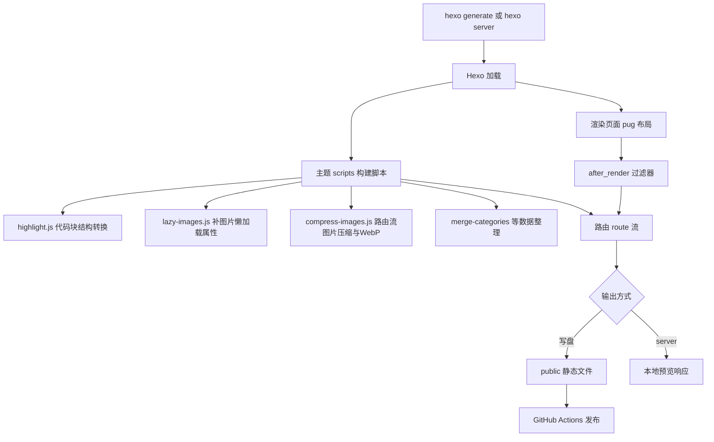
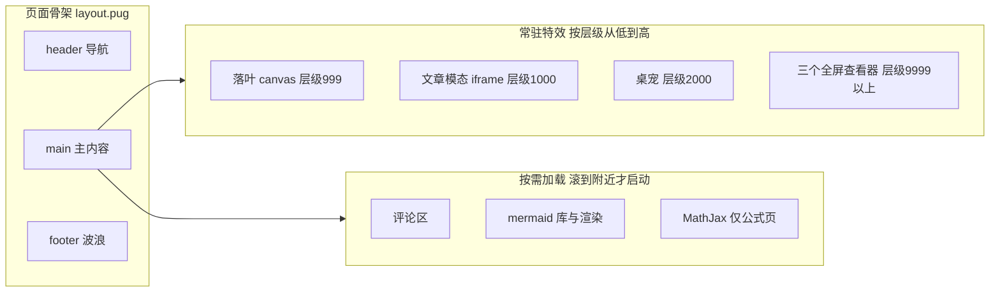
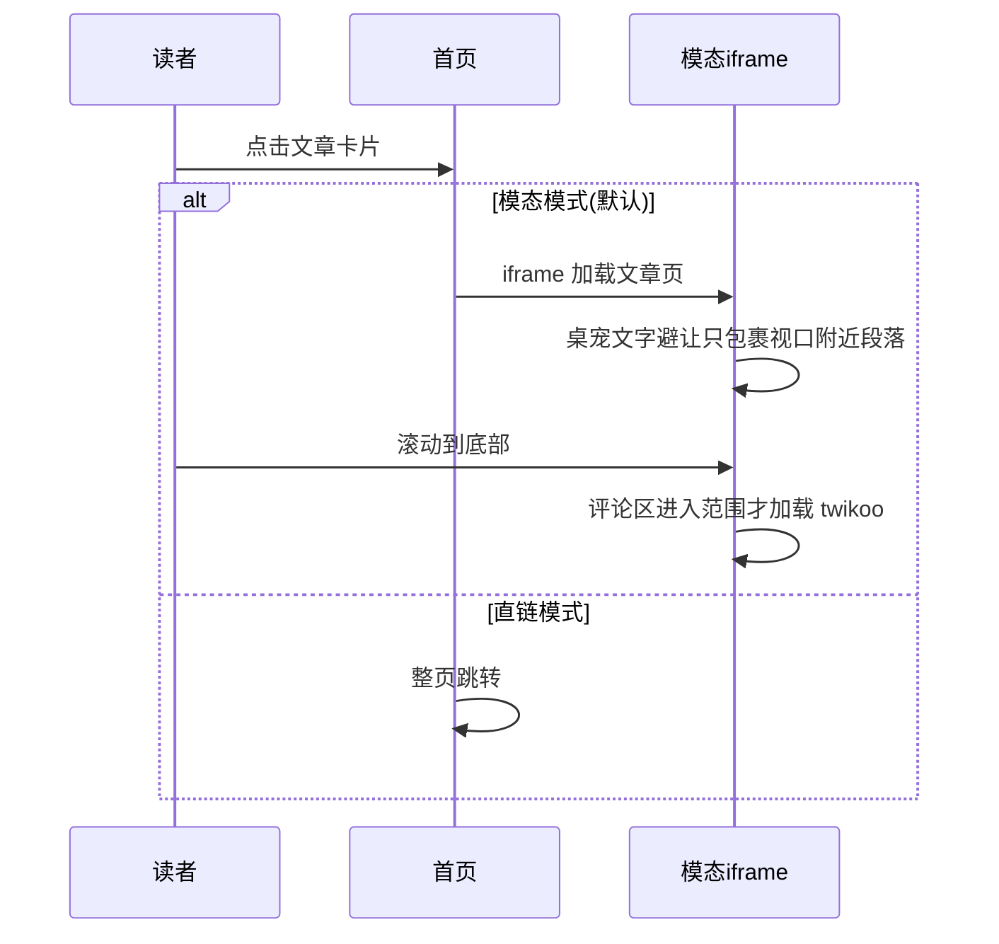

# 01 架构总览

## 一、构建期流水线

关键设计:压缩与转换发生在路由流上,而不是扫描 public 文件夹,因此一次
`hexo generate` 即完成,`hexo server` 预览看到的也是压缩后效果。

## 二、页面运行时组件

层级规则:落叶在模态背后;桌宠在模态之上、全屏查看器之下;模态 iframe
内打开全屏查看器时,通过 postMessage 通知父页面把桌宠临时沉底并静音粒子。

## 三、文章浏览的两种模式

## 四、脚本加载策略

- 全站脚本使用 defer,不阻塞 HTML 解析,保持文档顺序执行,且都在
  DOMContentLoaded 之前跑完;
- pjax 换页后由 pjax-init 重新派发 DOMContentLoaded 唤醒各模块,模块内部
  用幂等标记防重入;
- 三类重资源按视口触发:评论(600px 范围)、mermaid(正负 1.5 屏才下载库
  并渲染)、MathJax(正文含公式才加载且等浏览器空闲)。

## 五、特效层级总表

| 组件 | z-index | 说明 |
|---|---|---|
| 落叶 canvas | 999 | 正文之上,模态与查看器之下 |
| 文章模态 | 1000 | 全屏 iframe |
| 桌宠(含影子光环气泡) | 2000 | 模态之上,要在模态里跑动 |
| 桌宠烟雾粒子 | 2001 | 查看器打开时静音不生成 |
| 桌宠右键菜单 | 2001 | 与桌宠同族 |
| 图片表格mermaid查看器 | 9999~10020 | 最高层,打开时联动桌宠沉底 |
