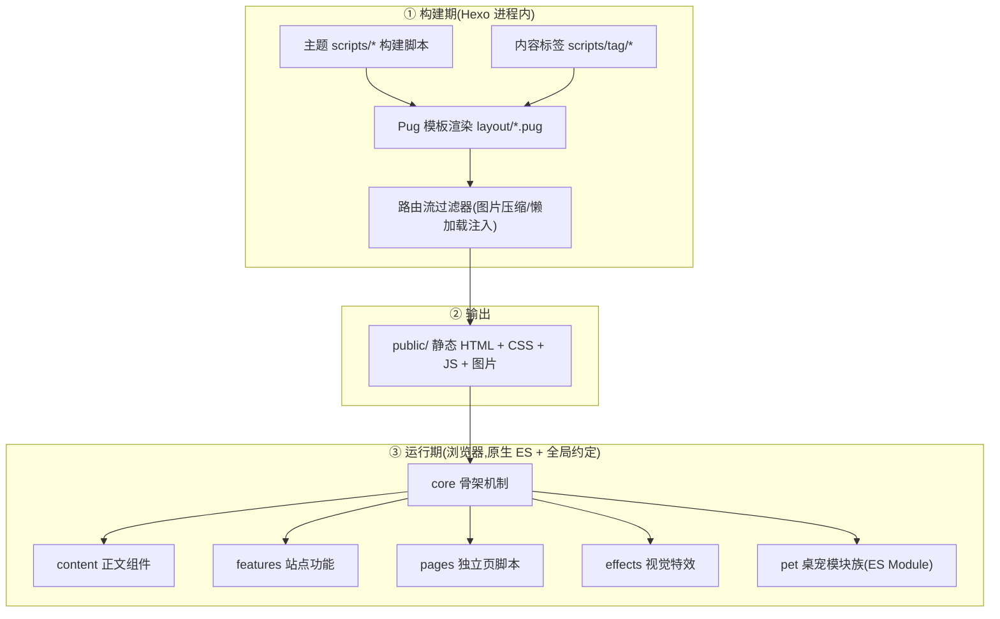
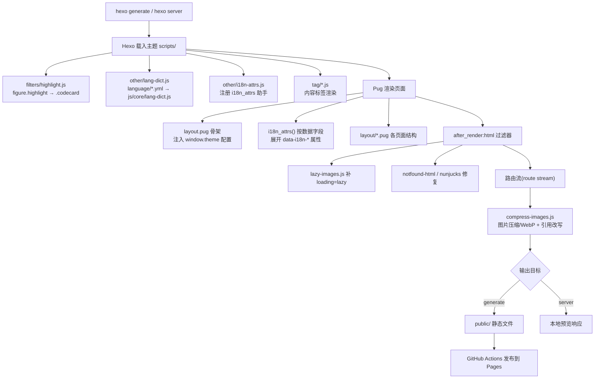
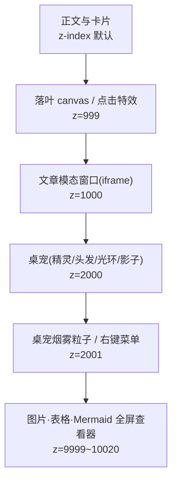
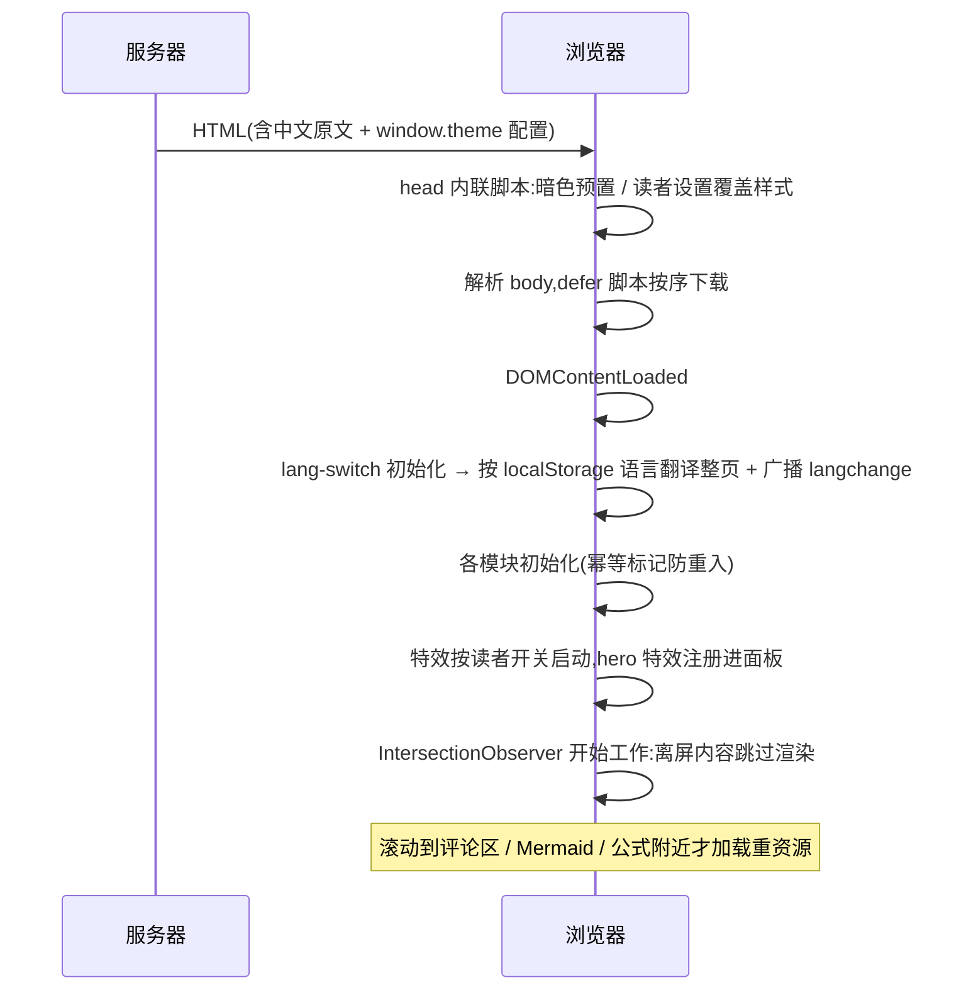

# 01 架构总览

> 本文回答三个问题:主题由哪几层组成、一次构建发生了什么、页面在浏览器里怎么跑起来。

## 一、总体分层

主题是"**构建期 Pug 渲染 + 运行期原生 JS 模块**"的静态站点方案,没有前端框架、
没有打包器、没有构建产物依赖:



三条硬约束决定了整个架构:

| 约束 | 后果 |
|---|---|
| 静态托管,没有服务端 | 所有"动态"能力(搜索/评论/AI/切语言)都在浏览器完成 |
| pjax 只替换 `main.main`,不换 `<head>` | **所有页面级脚本与样式必须全局常驻**,靠页面 class 作用域隔离 |
| 一张页面可能被装进 iframe 模态 | 每个模块都要判断自己是否运行在 iframe 内,避免双份特效 |

## 二、目录结构

```
themes/magzine/
├── _config.yml          主题配置(全部可调项)
├── language/            多语言词条(zh 基准 + 各语言 yml + 旧字典备份)
├── layout/              24 个 Pug 模板(骨架 / 各页面 / _partial 组件)
├── scripts/             21 个构建期脚本(Hexo 自动加载)
│   ├── filters/         渲染过滤器(代码块结构重写)
│   ├── other/           生成器与 after_render(压缩/懒加载/i18n 字典…)
│   └── tag/             11 个内容标签
├── source/
│   ├── css/             28 个样式表(core / components / pages)
│   ├── js/              54 个运行期脚本(content/core/effects/features/pages/pet/vendor)
│   ├── images/          站点图片(封面轮播/头像/桌宠精灵图…)
│   ├── cursors/         动态光标帧序列
│   ├── lib/             本地化第三方库(Font Awesome)
│   └── fonts/           字体资源
└── docs/                本套文档 + 项目截图
```

## 三、构建期流水线



**关键点:图片压缩挂在"路由流"上而不是扫描 `public/`。** 因此一次
`hexo generate` 即完成(旧机制要跑两次),`hexo server` 预览看到的也是压缩后
效果。详见 [03-构建与部署](03-构建与部署.md)。

**多语言字典是构建产物。** `language/*.yml` 在构建期被拉链合成为
`public/js/core/lang-dict.js`,页面 HTML 里只有中文原文,译文全部运行期查表。
详见 [06-国际化架构](06-国际化架构.md)。

## 四、运行期组件与层级

页面上的常驻组件按 z-index 分层,顺序不能随意调整:



| 组件 | z-index | 说明 |
|---|---|---|
| 阅读进度条 | 900 | 顶部细条 |
| 落叶 canvas | 999 | 正文之上、模态之下 |
| 文章模态窗口 | 1000 | 全屏 iframe,内含完整文章页 |
| 桌宠(含影子/光环/气泡) | 2000 | 需要在模态窗口里也能跑动 |
| 桌宠粒子与右键菜单 | 2001 | 查看器打开时静音粒子 |
| 图片 / 表格 / Mermaid 查看器 | 9999~10020 | 最高层,打开时联动桌宠沉底 |
| 读者设置面板 | 100001 | 右键呼出,永远最上 |
| 英雄特效面板 | 10(局部) | 位于 `.hero-section` 内部 |

**跨层协作**:模态 iframe 内打开全屏查看器时,通过 `postMessage` 通知父页面把
桌宠临时沉底并静音粒子;模态内禁用读者设置面板(否则"确定设置"只刷新 iframe)。

## 五、脚本加载策略

1. **全站脚本 `defer`**:不阻塞 HTML 解析,保持文档顺序,且都在
   `DOMContentLoaded` 之前执行完毕;
2. **`window.theme` 配置注入**:`layout.pug` 在脚本之前内联输出主题配置,
   脚本启动时直接读,不再请求接口;
3. **`<head>` 内联的极少脚本**:暗色模式预置(防闪)、iframe 标记、
   读者设置覆盖样式(防闪)——这三件事必须在首屏绘制前完成;
4. **`inject.head` / `inject.bottom`**:主题配置里可追加自定义脚本,
   构建时自动补 `defer`;
5. **pjax 换页后重新派发 `DOMContentLoaded`**:各模块用幂等标记
   (`window.__xxx` / `data-xxx` / class)防止重复绑定;
6. **重资源按视口/空闲触发**:评论(±600px)、Mermaid(±1.5 屏)、
   MathJax(仅公式页且空闲时)。

## 六、模块间协作约定

主题刻意避免模块互相 import(桌宠除外),只通过少量全局约定通信:

| 全局约定 | 提供方 | 消费方 |
|---|---|---|
| `window.theme` | layout.pug 内联 | 几乎所有脚本读配置 |
| `window.__readerSettings` | reader-settings.js(内联) | 特效/桌宠/封面按读者开关禁用 |
| `window.i18n` | lang-switch.js | 所有需要取译文/格式化文案的脚本 |
| `window.HeroFX` | hero-panel.js | hero-fluid.js / hero-watercolor.js 注册特效 |
| `window.__magzinePjax` | pjax-init.js | load-more.js / 手机端刻度尺导航 |
| `window.shakeShuffle` | shake-shuffle.js | 友链 / 万花筒 / 追番页复用随机卡片 |
| `document` 上的 `langchange` | lang-switch.js | 打字机、搜索、加载更多、AI 面板重绘 |
| `pjax:send` / `pjax:complete` | pjax-init.js | 各模块暂停/恢复自身状态 |

## 七、页面类型与脚本归属

| 页面 | 模板 | 特有脚本 |
|---|---|---|
| 首页 | `index.pug` | `hero-panel` `hero-fluid` `hero-watercolor` `author-card` `load-more` `random-cards` |
| 文章页 | `post.pug` | `toc` `share` `postai` `just-read` `table` `mermaid` `image-zoom` |
| 独立页 | `page.pug` | 与文章页同构,靠 `data-post-page` 区分 |
| 关于 | `about.pug` | `pages/about.js` |
| 友链 | `link.pug` | `pages/link.js` + `shake-shuffle` |
| 追番 | `anime.pug` | `pages/anime.js` + `random-cards` |
| 照片墙 | `wall.pug` | `pages/wall.js` |
| 万花筒 | `murmur.pug` | `random-cards` + `murmur-video` 门面 |
| 归档/分类/标签 | `archive/category/tag/categories.pug` | `categories-accordion` `categories-explorer` |
| 404 | `404.pug` | — |

所有页面共享 `core/*`(骨架机制)与 `content/*`(正文组件),样式同理:
`core/main.css` + 各页面 `pages/*.css`(以页面级 class 作用域)。

## 八、一次首屏加载发生了什么



首屏因此只有 HTML + CSS + 少量本地 JS,没有框架运行时、没有远程字体、
没有阻塞式第三方脚本。
