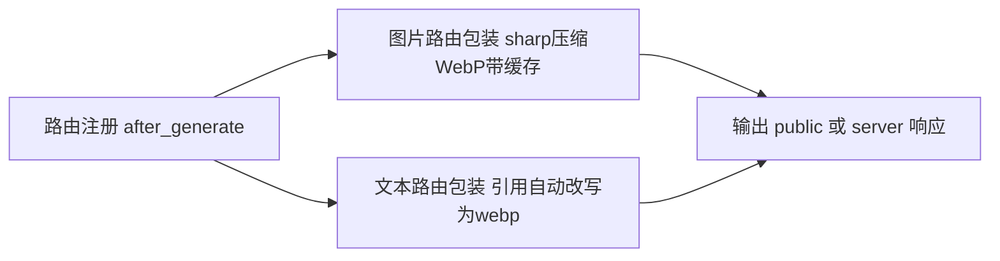
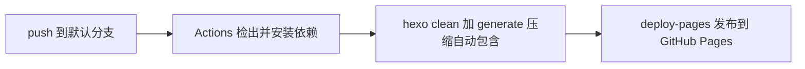

# 03 构建与部署

## 一、图片压缩机制(路由流)

详细机制见[图片压缩与工作流指南](../图片压缩与工作流指南.md),此处摘要:



- 一次 `hexo generate` 完成(旧机制需跑两次,已重写);
- `hexo server` 预览即压缩后效果,转换有 400MB FIFO 缓存;
- 配置见主题 `_config.yml` 的 `compress_images:` 块;
- `protect` 列表保护 JS 动态拼路径的资源(桌宠精灵图/光标帧)。

## 二、本地工作流

```bash
npm install            # 含 sharp
hexo clean             # webp 模式先清旧产物
hexo generate          # 构建+压缩,一次完成
hexo server            # 预览(即线上效果)
```

## 三、GitHub Actions 部署

仓库 `.github/workflows/hexo-deploy.yml`(仓库级文件,不属于主题):



**CI/CD 与本地压缩的关系**:压缩逻辑在主题里,跑在 `hexo generate` 内部——
它在本地跑就是在本地压缩,在 Actions 跑就是在 CI 压缩。CI 的价值不是压缩本身,
而是**免本地构建发布**:你只提交文章源码(push),GitHub 云端完成
构建(含压缩)并发布,本地一个字节产物都不用生成。

一次性开通:仓库 Settings → Pages → Source 选 "GitHub Actions";
确认 workflow 里 `branches` 与默认分支一致。

## 四、发布前自检清单

- [ ] 新增图片单张是否超过 2MB(超了先压)
- [ ] `hexo clean && hexo generate` 无 ERROR
- [ ] 本地 `hexo server` 抽查首页/长文/代码块/表格/图表
- [ ] 文章正文图片有 alt
- [ ] Actions 运行成功、Pages 可访问
