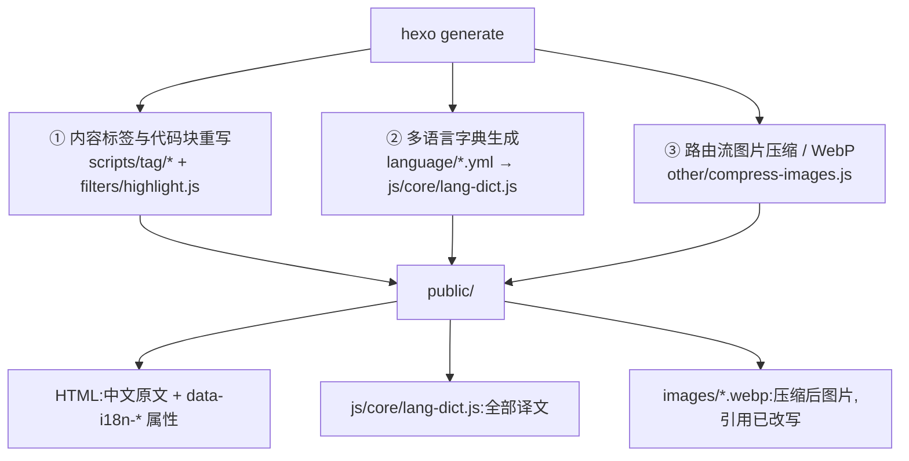
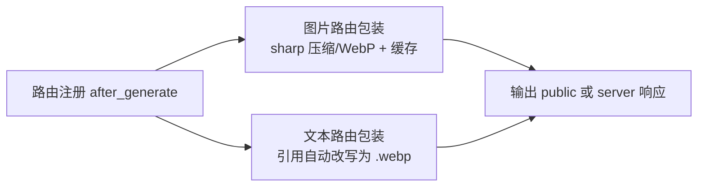
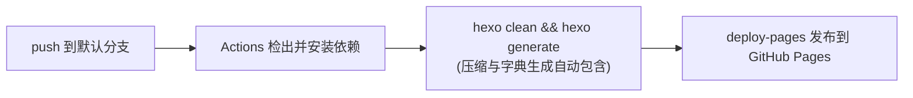

# 03 构建与部署

## 一、构建期会发生的三件事

`hexo generate`(或 `hexo server`)时,除了常规的 Pug 渲染,主题还会做三件
"看不见"的工作:



三者的共同点:**都在 `hexo generate` 内部完成,不需要额外命令、不需要后处理。**

## 二、多语言字典生成

`scripts/other/lang-dict.js` 是一个 Hexo 生成器:

- 读 `language/zh.yml`(基准,值是中文原文)与其余语言 yml;
- 按**键**把两份文件拉链起来,产出运行时查表字典:

```js
// public/js/core/lang-dict.js
window.__MAGZINE_LANG_DICTS__ = {
  en: { "首页": "Home", "咒术回战第一季": "Jujutsu Kaisen Season 1", ... },
  ja: { ... },
  ru: { ... }
};
window.__MAGZINE_LANG_META__ = {
  zh: { flag: "🇨🇳", label: "中文" },
  ru: { flag: "🇷🇺", label: "Русский" }
};
```

- 缺键会打警告:`lang-dict: [ja] 以下键缺失,已跳过 → tag.back_to_all`;
- 同一个中文文案若在不同键上对应了不同译文会打冲突警告(运行时以中文为查表键,
  只能保留一条)。

页面 HTML 里只有中文原文,译文全部运行期查表——因此**加语言不增加页面体积**。
详见 [06-国际化架构](06-国际化架构.md)。

## 三、图片压缩机制(路由流)

详细机制见[图片压缩与工作流指南](图片压缩与工作流指南.md),此处摘要:



- 一次 `hexo generate` 完成(旧机制需跑两次,已重写);
- `hexo server` 预览即压缩后效果,转换带 400MB FIFO 缓存;
- 配置见主题 `_config.yml` 的 `compress_images:` 块;
- `protect` 列表保护 JS 动态拼路径的资源(桌宠精灵图/光标帧)。

出现下面这行即成功:

```bash
🖼 [Image Compressor] webp 模式:807 张图片输出时转为 webp,文本引用自动改写(涉及 269 个文本路由)
```

## 四、本地工作流

```bash
npm install            # 含 sharp
hexo clean             # 换 webp 模式时先清旧产物
hexo generate          # 构建 + 压缩 + 字典生成,一次完成
hexo server            # 本地预览(即线上效果)
```

改完 `language/*.yml` 只需重新 `hexo generate`;若同时改了 Pug 模板与数据字段,
建议 `hexo clean && hexo generate` 以确保新属性进入产物。

## 五、GitHub Actions 部署

仓库 `.github/workflows/hexo-deploy.yml`(仓库级文件,不属于主题):



**CI 与本地压缩的关系**:压缩与字典生成逻辑在主题里,跑在 `hexo generate` 内部
——在本地跑就在本地压缩,在 Actions 跑就在云端压缩。CI 的价值不是压缩本身,而是
**免本地构建发布**:只提交文章源码(push),云端完成构建并发布,本地一个字节产物
都不用生成。

一次性开通:仓库 Settings → Pages → Source 选 "GitHub Actions";确认 workflow 里
`branches` 与默认分支一致。

## 六、发布前自检清单

- [ ] 新增图片单张是否超过 2MB(超了先压)
- [ ] `hexo clean && hexo generate` 无 ERROR
- [ ] 构建日志里没有 `lang-dict` 的缺键/冲突警告(若有,补齐对应语言 yml)
- [ ] 本地 `hexo server` 抽查首页 / 长文 / 代码块 / 表格 / 图表
- [ ] 抽查一次语言切换:导航、卡片标题、日期格式是否都跟随
- [ ] 文章正文图片有 alt
- [ ] Actions 运行成功、Pages 可访问

## 七、附录:GitHub 密钥误报(Push Protection)

**现象**:`hexo d` 推送被拒(GH013),提示 Tencent Cloud Secret ID,位置
`js/vendor/twikoo.all.min.js:2`。

**原因**:twikoo 管理后台内置了"腾讯云 CloudBase 部署配置"的**示例占位字符串**,
格式恰好是 AKID 开头的腾讯云 SecretId 样子,被 GitHub 密钥扫描按格式误判。它不是
真实密钥、不是 CDN 配置,与站点部署无关(评论后端在 Vercel 时该配置项用不到)。

**处理**(本主题已完成):vendor 文件中的占位串已替换为不匹配扫描模式的无害同长度
字符串,不影响 twikoo 任何功能。若部署机残留含旧串的提交历史(报错里的 commit 号),
删除部署机的 `.deploy_git` 文件夹后再 `hexo d`,让推送历史从全新提交开始即可绕开旧提交。
