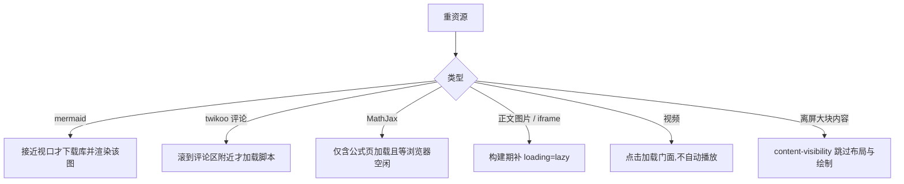
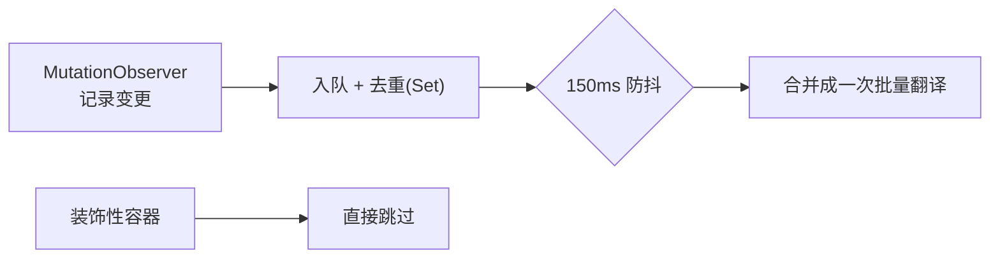
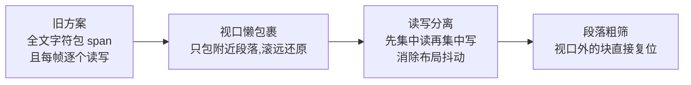
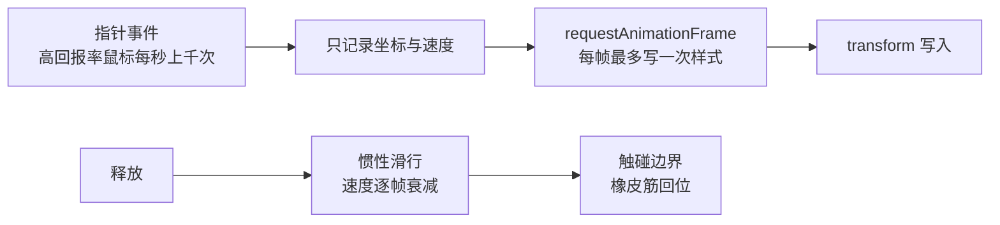

# 05 性能设计

> 记录"为什么这样做",方便二次开发时不小心破坏这些设计。每一条都是踩过坑的结论。

## 一、按视口加载(Astro client:visible 思想的落地)

**坑位记录(改前必读)**:

1. `content-visibility` 不能加在带绝对定位装饰的容器上(paint 裁剪会剪掉代码块
   工具栏、mermaid 全屏按钮)——只加在 `.table-wrapper / iframe / video /
   mjx-container / .hexo-video-embed`。
2. `content-visibility` 不能加在需要量高度做决策的元素上(折叠判断会拿到
   320px 估算值)——所以 `.codecard` 没加。
3. 阅读显现动画只作用于**永不被脚本移动的元素白名单**(`p/h1-h6/ul/ol/
   blockquote/hr`);`table.js` 会重排表格、`mermaid.js` 会替换 `pre`,对它们做
   动画会导致"替换后的新元素永远 `opacity:0`"。

## 二、翻译层是低频批处理,不是逐条同步

语言切换层给**每个元素**做翻译扫描,而页面上的 DOM 动画(打字机、几何漫游、
播放器进度、桌宠文字避让)每秒会产生成百上千次变更。若对每条 MutationObserver
记录都同步翻译,主线程会被拖垮(实测表现为整页卡顿、界面近乎无响应)。

因此 `core/lang-switch.js` 采用:

- **收集 + 150ms 防抖 + 去重**:变更只入队,合并成一批处理;
- **跳过装饰性容器**:`.hero-fx-layer`(流体/水彩 canvas)、`.hero-typing`
  (打字机逐字重写)、`#background-shapes`(几何漫游)、`.music-player`、
  `.sakana-widget`、`canvas/svg/script/style` 一律不进入翻译队列;
- **幂等**:翻译每次都从 `data-i18n-*` 属性重新取值,不基于当前 DOM 文本推断,
  所以重复触发不会出现"二次翻译";
- **打字机文本不走翻译层**:它由 `main.js` 在打字前主动向 `window.i18n` 取词
  (放进跳过名单才不会被每 50ms 触发一次翻译);
- **切语言后重绘**:翻译层广播 `langchange`,由运行时自行生成文案的组件
  (搜索计数、"加载更多"按钮、AI 面板)自己重绘,翻译层不去猜它们的文案。

详见 [06-国际化架构](06-国际化架构.md)。

## 三、桌宠文字避让的三层优化

实测:长文同时存在的字符 span 从全文字数降到 ~200。

## 四、拖拽手感 = rAF 合帧 + 惯性

**为什么不用 `will-change: transform`**:它会把元素预栅格化成 GPU 纹理,放大
(尤其矢量 SVG)时沿用低分辨率纹理 → 文字模糊。流畅度靠 rAF 合帧已经足够。

## 五、路由流压缩的由来

旧机制扫 `public/` 文件夹,而 Hexo 的 `after_generate` 在写盘**之前**触发,
第一次构建时 `public` 是空的 → 必须连跑两次。路由流方案把转换挂在数据流上,与
输出时机解耦,同时天然覆盖 `hexo server` 预览;server 模式每次请求都会重拉路由流,
所以加了 400MB FIFO 转换缓存(没有它每次刷新都全量重压缩,server CPU 打满、页面
超时——即"模态空白/文字消失"事故的根因)。

## 六、首屏没有的东西

以下都刻意**没有**引入,是首屏体积能保持很小的原因:

| 没有 | 替代方案 |
|---|---|
| 前端框架运行时(React/Vue) | 原生 JS 模块 + 少量全局约定 |
| 打包器与 polyfill | `defer` 顺序加载源文件,浏览器原生 ESM 只用于桌宠 |
| 远程字体(Google Fonts) | 保留字体栈名称,实际回退系统字体 |
| 阻塞式第三方脚本 | 全部本地化(`vendor/`、`lib/`)或按需加载 |
| 每页内联的翻译字典 | 独立可缓存的 `js/core/lang-dict.js` |
| 首屏就渲染的评论/图表/公式 | 按视口或空闲触发 |

## 七、加载顺序约定

1. `<head>` 内联:暗色模式预置(防闪)、iframe 标记、读者设置覆盖样式(防闪);
2. 全站脚本 `defer`(保持文档顺序,`DOMContentLoaded` 前执行完);
3. `window.theme` 配置在脚本之前内联输出,脚本启动零请求;
4. 重资源按视口/空闲触发;
5. pjax 换页重派发 `DOMContentLoaded`,模块以幂等标记防重入
   (`window.__xxx` / `data-xxx` / class 标记)。
