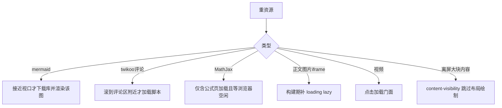
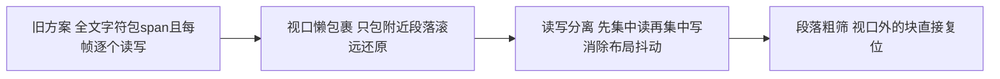
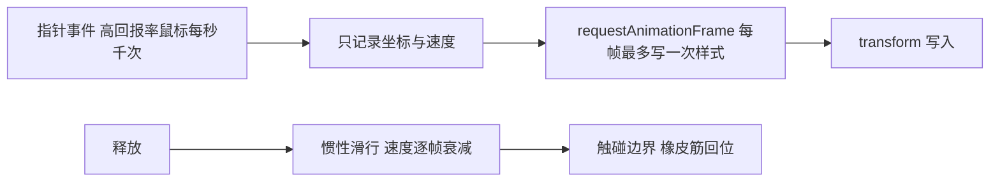

# 05 性能设计

> 记录"为什么这样做",方便二次开发时不小心破坏这些设计。

## 一、按视口加载(Astro client:visible 思想的落地)

**坑位记录**(改前必读):
1. `content-visibility` 不能加在带绝对定位装饰的容器上(paint 裁剪会
   剪掉代码块工具栏/mermaid 全屏按钮)——只加在
   `.table-wrapper / iframe / video / mjx-container / .hexo-video-embed`。
2. `content-visibility` 不能加在需要量高度做决策的元素上(折叠判断会
   拿到 320px 估算值)——所以 `.codecard` 没加。
3. 阅读显现动画只作用于**永不被脚本移动的元素白名单**(p/h/ul/ol/
   blockquote/hr);table.js 会重排表格、mermaid.js 会替换 pre,
   对它们做动画会导致"替换后的新元素永远 opacity:0"。

## 二、桌宠文字避让的三层优化

实测:长文同时存在的字符 span 从全文字数降到 ~200。

## 三、拖拽手感 = rAF 合帧 + 惯性

**为什么不用 will-change**:`will-change: transform` 会把元素预栅格化成
GPU 纹理,放大(尤其矢量 SVG)时沿用低分辨率纹理 → 文字模糊。
流畅度靠 rAF 合帧已足够。

## 四、路由流压缩的由来

旧机制扫 public 文件夹,而 hexo 的 `after_generate` 在写盘**之前**触发,
第一次构建时 public 是空的 → 必须连跑两次。路由流方案把转换挂在数据流上,
与输出时机解耦,同时天然覆盖 `hexo server` 预览;server 模式每请求重拉
路由流,所以加了 400MB FIFO 转换缓存(没有它每次刷新都全量重压缩,
server CPU 打满、页面超时——即"模态空白/文字消失"事故的根因)。

## 五、加载顺序约定

1. `<head>` 内联:暗色模式预置(防闪)、iframe 标记、reader-settings;
2. 全站脚本 `defer`(保持文档顺序,DOMContentLoaded 前执行完);
3. 重资源按视口/空闲触发;
4. pjax 换页重派发 DOMContentLoaded,模块以幂等标记防重入
   (`window.__xxx` / `data-xxx` / class 标记)。
