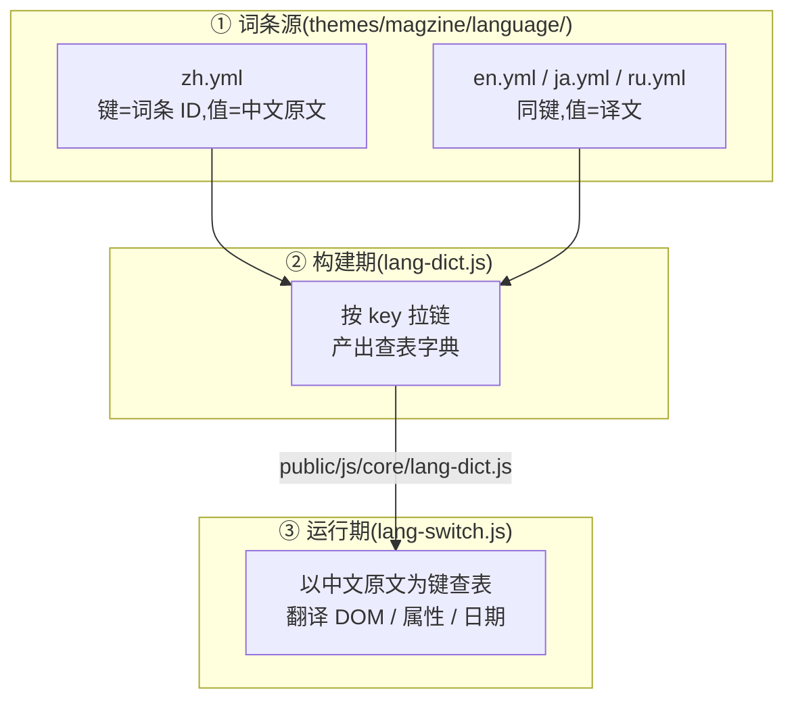
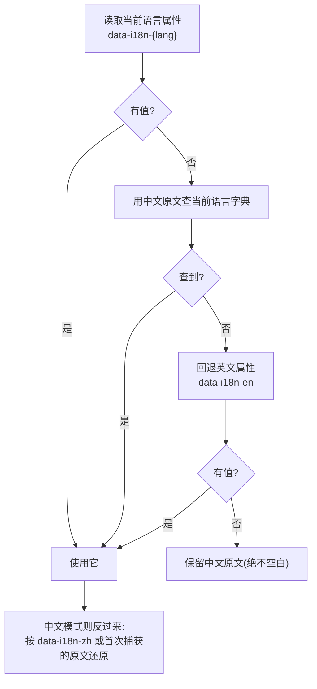

# 06 国际化架构

> 主题采用**运行时翻译层**方案:页面始终由 Hexo 以基准语言(中文)渲染,浏览器
> 在运行时把界面文本替换成目标语言。它不是服务端多语言站点生成。

## 一、为什么是运行时方案

| 方案 | 代价 |
|---|---|
| 服务端生成多份语言站点 | 页面数 ×N、图片与缓存重复、pjax 与模态窗口要重做 |
| 前端框架 i18n | 需要引入框架运行时,与"零框架、pjax 只换 `main.main`"的架构冲突 |
| **运行时翻译层(本主题)** | 一份 HTML + 一份可缓存的字典文件,任何已有的动态组件都能复用 |

于是设计目标变成:**在不动模板结构、不动构建产出规模的前提下,让界面文本、数据
字段、日期格式、动态组件文案都能跟随语言。**

## 二、三层结构



### ① 词条源:`language/*.yml`

**抽象键命名 + 分节组织**,便于维护与对照:

```yaml
# zh.yml(基准)
nav:
  home: 首页
anime:
  title_14: 间谍过家家第二季
about:
  card_1_title: 逃离后室
```

```yaml
# en.yml
nav:
  home: Home
anime:
  title_14: SPY×FAMILY Season 2
about:
  card_1_title: Escape the Backrooms
```

每份语言文件顶层的 `_meta` 提供语言按钮的显示信息:

```yaml
_meta:
  flag: "🇷🇺"
  label: Русский
```

**注意:键名只是给人看的。** 运行期以**中文原文**为查表键,所以 `title_14` 还是
`whatever` 都不影响——只要 `zh.yml` 与译文文件里键名一致即可。

### ② 构建期:合成字典

`scripts/other/lang-dict.js` 把 `zh.yml` 的**值**当作键、译文当作值,产出:

```js
window.__MAGZINE_LANG_DICTS__ = {
  en: { "首页": "Home", "间谍过家家第二季": "SPY×FAMILY Season 2", ... },
  ja: { ... }, ru: { ... }
};
window.__MAGZINE_LANG_META__ = { zh: {...}, ru: { flag: "🇷🇺", label: "Русский" } };
```

构建期会检查:某语言缺键 → 打警告跳过;同一个中文文案对应了两种译文 → 打冲突警告
(运行期同中文只能保留一条)。语言清单也从目录扫描得出,因此**新增语言不用改任何
JS**。

### ③ 运行期:翻译 DOM

`core/lang-switch.js` 是唯一的翻译入口,对外暴露 `window.i18n`:

| API | 用途 |
|---|---|
| `i18n.get(text)` | 查词条(当前语言 → 英文兜底 → 原样返回) |
| `i18n.format(tpl, vars)` | 带 `{占位符}` 的模板:查译文再填值 |
| `i18n.lang()` / `i18n.langs()` | 当前语言 / 全部可用语言 |
| `i18n.applyLanguage(lang)` | 原地切换语言(幂等,可重复调用) |
| `i18n.translateNode(el)` | 手动翻译新插入的节点 |
| `i18n.translateDates()` | 按当前语言刷新日期格式 |

语言按钮按 `langs()` 循环切换(zh → en → ja → ru → zh),移动端顶栏只显示当前
语言的国旗。

## 三、内容翻译:显式字段优先

界面词条走字典就够了,但**内容**(文章标题、番剧名、友链描述)不适合塞进字典
——那是数据。因此数据文件支持显式语言字段:

```yaml
# source/_data/anime/间谍过家家第二季.yml
- title: 间谍过家家第二季
  title_en: "SPY×FAMILY Season 2"
  title_ja: "SPY×FAMILY シーズン2"
```

模板侧用 Pug 助手自动展开属性,不需要为每种语言写一行:

```pug
h3(data-i18n-zh=item.title)&attributes(i18n_attrs(item, 'title'))= item.title
```

`scripts/other/i18n-attrs.js` 会扫描 `language/` 目录里实际存在的语言,输出:

```html
<h3 data-i18n-zh="间谍过家家第二季"
    data-i18n-en="SPY×FAMILY Season 2"
    data-i18n-ja="SPY×FAMILY シーズン2">间谍过家家第二季</h3>
```

属性版用于 `alt`/`title` 等:

```pug
img(src=item.cover alt=item.title)&attributes(i18n_attrs(item, 'title', 'alt'))
```

**所以新增一种翻译 = 在数据文件里加一个 `xxx_<lang>` 字段**,模板、JS 都不用动。
没有写该字段的项不会输出空属性,也不会报错。

## 四、取值优先级与兜底

文本与属性走同一套判断(`applyExplicitText` / `applyExplicitAttrs`):



要点:

- **字典优先于英文属性**:当前语言的字典里若有这条内容的译文(如番剧名的
  俄语译名),优先用它;实在没有才退回英文属性。这样"除中文外用英文"的兜底不会
  把已有的译文盖掉;
- **字典自身也有兜底**:某语言缺键时回退英文字典,因此漏翻一条界面词只会显示
  英文,不会蹦中文、更不会空白;
- **首次替换前自动捕获中文原文**:仅写了译文属性的元素,第一次翻译时会把当时的
  文本/HTML 存进 `data-i18n-zh`(或 expando 属性),切回中文时用它精确还原;
  `data-i18n-captured` 标记防止把已翻译文本误存为原文;
- **幂等**:每次都从属性重新渲染,不把已翻译文本再喂给字典,所以来回切换不会
  出现"翻译的翻译"。

## 五、日期格式

| 语言 | 首页/文章卡片 | 归档页 |
|---|---|---|
| 中文 | `2026年9月14日` | `9月14日` |
| 英文 | `Sep 14, 2026` | `Sep 14` |
| **其他所有语言** | `2026-9-14` | `9-14` |

即:中英各自的本土写法,其余语言统一国际格式——**新增语言无需再处理日期**。
实现方式是把标准日期写在 `datetime` / `data-date-standard` 属性上,由
`translateDates()` 按当前语言重算文本(内部幂等,观察器可反复触发)。

## 六、动态内容怎么跟上

运行时生成的文案(搜索结果计数、"加载更多"按钮、AI 面板提示、打字机)不在字典
里,翻译层无法"事后纠正",因此约定:

1. 翻译层在初始化完成与每次切换后派发 `langchange` 事件;
2. 自行生成文案的组件监听它并重绘:

| 组件 | 做法 |
|---|---|
| 搜索 | 重跑当前查询,计数走 `i18n.format("找到 {n} 个结果", {n})` |
| 加载更多 | 按钮与页码提示按当前语言重渲染 |
| 首页打字机 | 打字前向 `i18n.get()` 取词;切换语言时重置并重新打字(用代际令牌淘汰旧动画链) |
| AI 摘要面板 | 模板化文案记下模板 + 变量,切换时按新语言重绘;AI 生成内容保持不变 |
| 番剧播放器 | 标题等经 `i18n.get()` 取词 |

## 七、AI 的回复语言

提示词写在语言文件里,所以 **AI 用什么语言回答由界面语言决定**:

```yaml
ai:
  prompt_summary: "请根据以下文章内容生成一个简洁的摘要…{content}"
  prompt_inspiration: "你是一个灵感发生器…"
  content_wrapper: "文章标题：{title}。文章内容：{content}"
  init: "{name}初始化中..."
  error: "{name}请求AI出错了，请稍后再试。"
  rate_limited: "请求过于频繁，请稍后再请求AI。"
```

俄语界面发出的提示词就是俄语版("на РУССКОМ языке"),日语界面要求
"日本語で生成"。新增语言时把这几条翻好即可。

## 八、新增一种语言(四步)

以韩语 `ko` 为例:

1. 复制 `language/en.yml` 为 `language/ko.yml`;
2. 把每个值翻成韩语,并把顶层 `_meta` 改成 `{ flag: "🇰🇷", label: "한국어" }`;
3. `npm run build`(`hexo generate`);
4. 完成——语言按钮自动多出一个循环项,日期自动走国际格式,`i18n_attrs` 会自动为
   有 `xxx_ko` 字段的数据输出 `data-i18n-ko` 属性。

改文案同理:改 `language/*.yml` 后重新构建。

## 九、容错能力

| 场景 | 表现 |
|---|---|
| 数据项没写 `_en`/`_ja` 字段 | 用字典兜底;字典也没有则显示中文原文,**不空白** |
| 某语言 yml 缺键 | 回退英文字典;再没有则原样返回 |
| 属性值为空字符串 | 视为未提供,继续下一级兜底 |
| 只写了非当前语言的属性 | 按优先级继续兜底 |
| 两种语言来回切换 | 从属性重新渲染,幂等,无重复翻译 |
| 数据里出现新内容 | 未翻译时显示原中文,不会报错 |

## 十、已知局限

| 局限 | 说明 |
|---|---|
| SEO 与禁用 JS 环境 | 抓取到的是基准语言(中文) |
| 首屏极短闪烁 | 页面先以中文绘制,随后被翻译层替换(已在 `<head>` 提前读取语言偏好) |
| 按文本精确匹配 | 字典兜底要求中文原文一字不差;改了原文需同步改字典值 |
| 同中文只能一条译文 | 两处相同文案共用一条译文;不同译文的冲突会在构建日志警告 |
| 文章正文不翻译 | 正文双语属内容工程,需要独立的正文方案,不在本层范围内 |
| 第三方组件内部 | 评论、播放器等第三方 iframe 内部文本不受本层控制 |

## 十一、相关文件速查

| 文件 | 作用 |
|---|---|
| `language/zh.yml` | 基准字典(定义有哪些词条 + 中文原文) |
| `language/<lang>.yml` | 各语言译文 + 语言 `_meta` |
| `scripts/other/lang-dict.js` | 构建期合成 `js/core/lang-dict.js` 与语言元信息 |
| `scripts/other/i18n-attrs.js` | `i18n_attrs()` Pug 助手,自动展开 `data-i18n-*` |
| `source/js/core/lang-switch.js` | 运行期翻译层,暴露 `window.i18n`,广播 `langchange` |
| 数据文件里的 `*_en` / `*_ja` / … | 内容的显式译文(优先级最高) |
