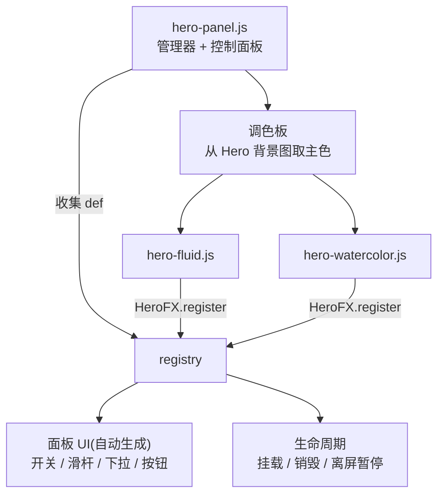
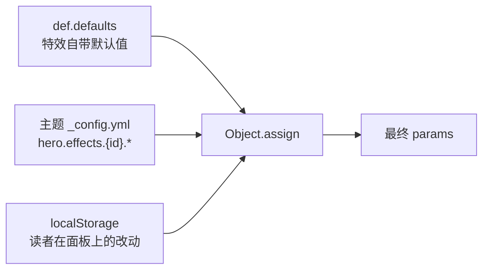

# 07 首页特效框架

> 首页 Hero 区的特效(流体模拟、水彩光晕)不是两个写死的功能,而是**一个可扩展
> 的特效框架**:特效自己注册、参数自己声明、UI 由框架生成、状态由框架持久化。

## 一、组成



| 文件 | 角色 |
|---|---|
| `effects/hero-panel.js` | 管理器:注册表、参数合并、挂载与销毁、离屏暂停、控制面板 UI、调色板、状态持久化 |
| `effects/hero-fluid.js` | 流体模拟特效(WebGL,基于 WebGL-Fluid-Simulation 移植) |
| `effects/hero-watercolor.js` | 水彩光晕特效(着色器参考 Shadertoy `lsyfWD`) |

## 二、特效定义(def)

特效脚本只需调用一次 `window.HeroFX.register(def)`:

```js
window.HeroFX.register({
  id: "watercolor",            // 唯一标识,用于配置键与持久化
  name: "水彩光晕",             // 面板分组标题(运行期按当前语言查表)
  icon: "🖌️",                   // 分组图标
  defaults: { speed: 0.1, intensity: 0.55, hover: true },  // 默认参数
  controls: [                  // 面板控件声明(自动生成 UI,无需写 HTML)
    { key: "speed",     label: "动画速度", type: "range", min: 0, max: 1.5, step: 0.05 },
    { key: "intensity", label: "光晕强度", type: "range", min: 0, max: 1,   step: 0.05 },
    { key: "hover",     label: "悬停交互", type: "checkbox" },
  ],
  action: function (inst) { /* 可选:按钮型控件点击时执行 */ },
  create: createWatercolor,    // 工厂:返回实例
});
```

`create(layer, params, ctx)` 必须返回:

```js
{
  destroy(),                 // 移除 canvas / 释放 GL 资源 / 解绑事件
  setParam(key, value),      // 面板调参时即时生效
  setVisible?(visible),      // 可选:离屏时暂停渲染
}
```

`controls` 支持的类型:`range`(带数值读数)、`select`(下拉)、`checkbox`、
`button`(需配 `action`)。

## 三、参数的合并顺序



即:**读者改动 > 主题配置 > 特效默认值**。读者点面板改动即写入 `localStorage`
(`heroFX`),因此主题改配置不会覆盖读者自己的选择。

## 四、生命周期

| 时机 | 行为 |
|---|---|
| `DOMContentLoaded`(pjax 会重新派发) | 挂载面板与启用的特效;已注册的特效直接启动,未注册的进入 `pendingBoot` 等待 |
| 特效脚本后到 | `register` 时发现已到启动点,立即按配置挂载 |
| Hero 区滚出视口 | `IntersectionObserver` + `visibilitychange` 暂停渲染(`setVisible(false)`),不空转 GPU |
| 切换特效开关 | 销毁旧实例、按新参数 `create`,避免双重 canvas |
| 点击面板外部 / `Esc` | 收起面板(状态持久化,下次进入保持) |

## 五、调色板

管理器会从 **Hero 背景图提取主色**存入 `HeroFX.palette`,供特效取色
(`color_source: image`);没有背景图或提取失败则回退随机配色。流体特效的初始
"喷发"颜色就来自这里,因此视觉上能与背景图协调。

## 六、新增一种特效(三步)

1. 新建 `source/js/effects/hero-xxx.js`,调用 `window.HeroFX.register(def)`
   (照抄 `hero-watercolor.js` 的结构最快);
2. `layout.pug` 的 hero 特效脚本区追加一行 `script(defer, src=url_for('js/effects/hero-xxx.js'))`
   ——**顺序无关**,框架会等待注册;
3. `_config.yml` 的 `hero.effects` 下加:

```yaml
hero:
  effects:
    xxx:
      enable: true
      # 与 def.defaults 同名的键会成为初始参数
```

面板分组、开关、滑杆、持久化、离屏暂停全部由框架接管,特效脚本里不用碰 UI。

## 七、与读者设置面板的关系

| 面板 | 位置 | 管什么 |
|---|---|---|
| 读者设置面板(右键) | `core/reader-settings.js` | 全站级开关:封面、首页图片、桌宠、播放器形态、无感刷新… |
| 特效面板(`✦ 特效`) | `effects/hero-panel.js` | 首页特效的参数与开关 |

两者互不干扰:读者设置面板里的 `hero` 项控制**首页大图是否启用**(整块隐藏则特效
不启动),特效面板控制**具体特效怎么跑**。

## 八、样式

`source/css/components/hero-effects.css` 负责面板外观:

- 面板窄条浮层(`min(246px, 100vw-24px)`),`max-height` 限制后**可滚动**,
  自带主题色细滚动条(6px,常驻可见,不随系统自动淡出);
- 控件行标签**允许换行**(长语言如俄语不会压到右侧控件上);
- 移动端断点收窄面板并对高度加上限,保证任何语言下面板都不会顶出屏幕;
- 自适应明暗模式与主题色。
