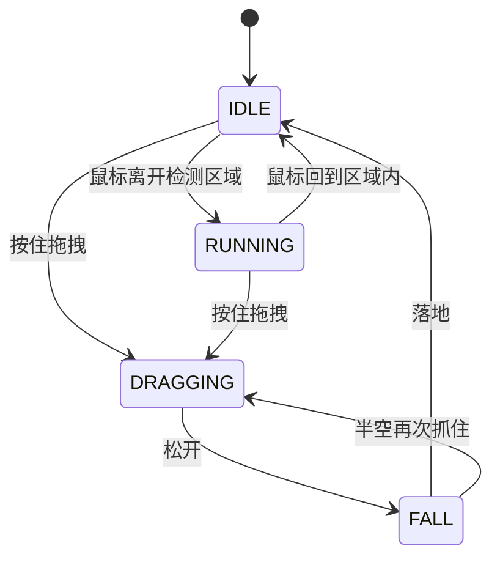

# 08 桌宠系统

> 桌宠是整个主题里唯一使用 **ES Module** 组织的模块族:9 个文件各管一件事,
> 由 `layout/_partial/pet.pug` 内的 `script(type="module")` 一次性装配。

## 一、装配方式

`pet.pug` 用原生 ESM 导入各模块并组装:

```js
import { PetSprite, State }      from '/js/pet/pet-sprite.js';
import { PetStateMachine }       from '/js/pet/pet-state.js';
import { PetHair }               from '/js/pet/pet-hair.js';
import { PetLayers }             from '/js/pet/pet-layers.js';
import { PetSound }              from '/js/pet/pet-sound.js';
import { PetOutline }            from '/js/pet/pet-outline.js';
import { PetChat }               from '/js/pet/pet-chat.js';
import { PetMusicPlayer }        from '/js/pet/pet-music.js';
import { PetPretextInteraction } from '/js/pet/pet-pretext-interaction.js';
```

桌面端默认启用,移动端由 `pet.mobile_enable` 控制;读者可在右键设置面板里关闭。

## 二、模块职责

| 模块 | 文件 | 职责 |
|---|---|---|
| 1 序列帧播放器 | `pet-sprite.js` | 按状态播放对应帧序列(见下表),控制帧率与水平翻转 |
| 2 状态机 + 主循环 | `pet-state.js` | 四态切换、位置与速度积分、鼠标交互、拖拽与投掷、边界回弹 |
| 3 头发物理 | `pet-hair.js` | 三根多节点发丝的弹性与惯性模拟 |
| 4 图层管理 | `pet-layers.js` | 统一管理各层 z-index 与显隐(含 `muteParticles`) |
| 5 音效 + 右键菜单 | `pet-sound.js` | 奔跑循环音效(音调随机)、静音开关、音量滑块 |
| 6 白色描边 | `pet-outline.js` | 四方向 `drop-shadow` 形成均匀像素风描边 |
| 7 聊天气泡 | `pet-chat.js` | 随机台词、定时触发、按交互情绪给反馈 |
| 8 迷你播放器 | `pet-music.js` | 挂在右键菜单里的音乐控制(上下曲/播放/循环/音量) |
| 9 文字避让 | `pet-pretext-interaction.js` | 桌宠走过时推开附近文字,走远复原 |

## 三、状态机



| 状态 | 序列帧 | 行为 |
|---|---|---|
| IDLE | `01.png`~`04.png` | 静止。以角色为中心的矩形检测区内有鼠标则保持;鼠标在左/右侧决定朝向 |
| RUNNING | `05.png`~`08.png` | 朝鼠标方向奔跑,循环播放跑步音效 |
| DRAGGING | `09.png`~`12.png` | 跟手移动;头发按物理力甩动;气泡给出挣扎台词 |
| FALL | `05.png`~`08.png`(复用) | 松手后受重力下落,落回地面回到 IDLE |

`DEBUG_ZONE` 开关可在开发时把检测区可视化。

## 四、图层

| z-index | 内容 |
|---|---|
| 40 | 精灵图 + 汗水粒子 |
| 30 | 头发(canvas 绘制) |
| 20 | 光环 |
| 5 | 烟雾粒子(沿移动轨迹排列) |
| 1 | 影子(最底层) |

桌宠整体所在层级(2000/2001)见 [01-架构总览](01-架构总览.md) 第四节——它必须高于
文章模态窗口,才能在模态里跑动;打开全屏查看器时由 `postMessage` 通知父页面把桌宠
临时沉底并静音粒子。

## 五、交互

| 操作 | 反馈 |
|---|---|
| 左键单击 | 戳一下:随机台词气泡 |
| 按住拖动 | 进入 DRAGGING,头发甩动,气泡抱怨 |
| 松开 | 进入 FALL,落地回到 IDLE |
| 右键 | 打开浮动菜单:静音开关、音量滑块、迷你音乐播放器 |
| 长时间不动 | 待机台词(无聊/困了/想听歌等随机) |

> 桌宠区域在读者设置面板的右键命中之外(`#pet-root` 已在排除名单里),
> 因此在桌宠身上右键只会弹它自己的菜单,不会弹出设置面板。

## 六、文字避让的性能设计

这是桌宠最有技术含量的一块,细节见 [05-性能设计](05-性能设计.md) 第三节:

- **视口懒包裹**:只把视口上下各一屏内的段落包成字符 `span`,滚远的段落还原成纯文本;
- **读写分离**:先集中读取布局信息,再集中写入样式,消除强制同步布局(布局抖动);
- **段落粗筛**:视口外的块直接复位,不做逐字符判断;
- **作用范围可配**:`pet.pretext_interaction.allow_selector` 限定只对
  `p/h1-h6/li/pre` 生效,`repel_radius` 与 `throttle_ms` 控制半径与节流。

实测长文同时存在的字符 span 从全文字数降到约 200。

## 七、素材

桌宠为**二次创作**:立绘帧与原型来自哔哩哔哩 @乌龙茶速递 的
《【BA同人游戏】番外-简单摸鱼写的爱丽丝桌宠》,在此基础上重做了状态机、头发
物理、图层合成、文字避让与菜单体系。素材位于 `source/images/pet/`
(在图片压缩的 `protect` 名单中,不会被改名或转 WebP)。署名见 README 致谢。
